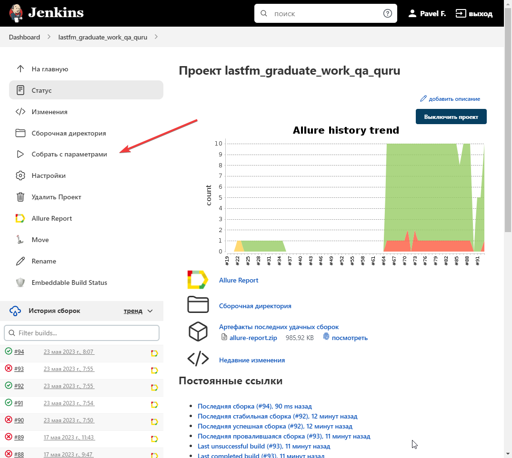
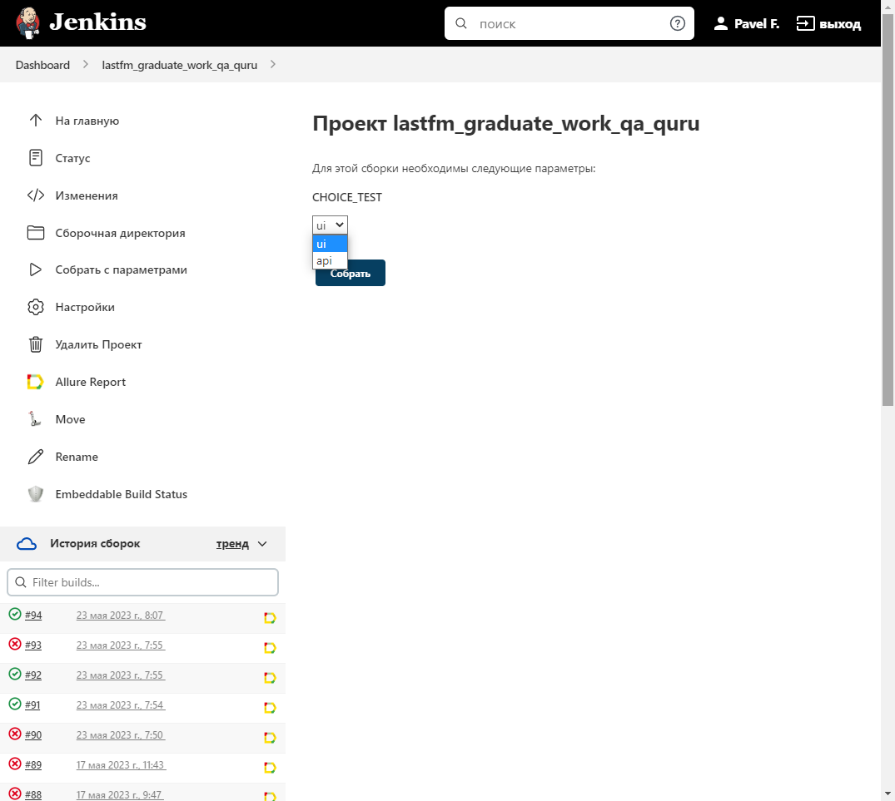
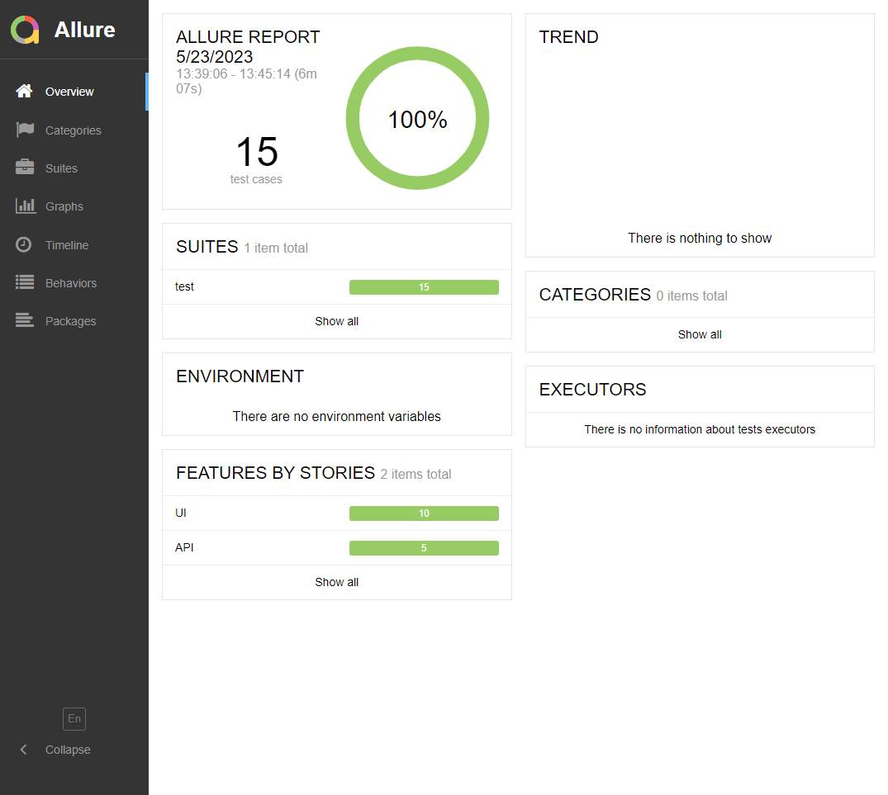
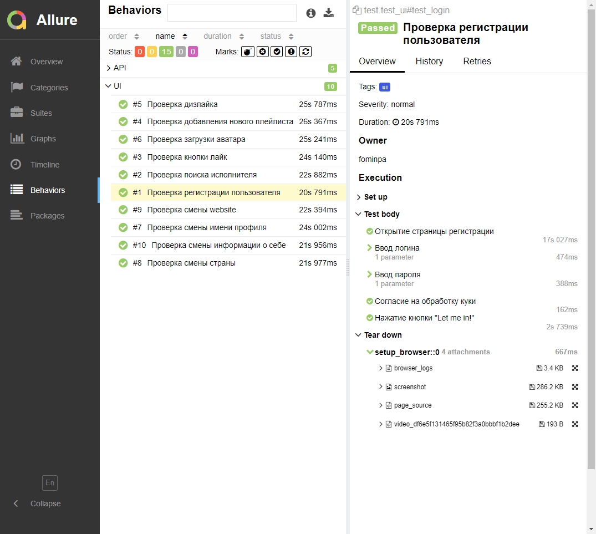
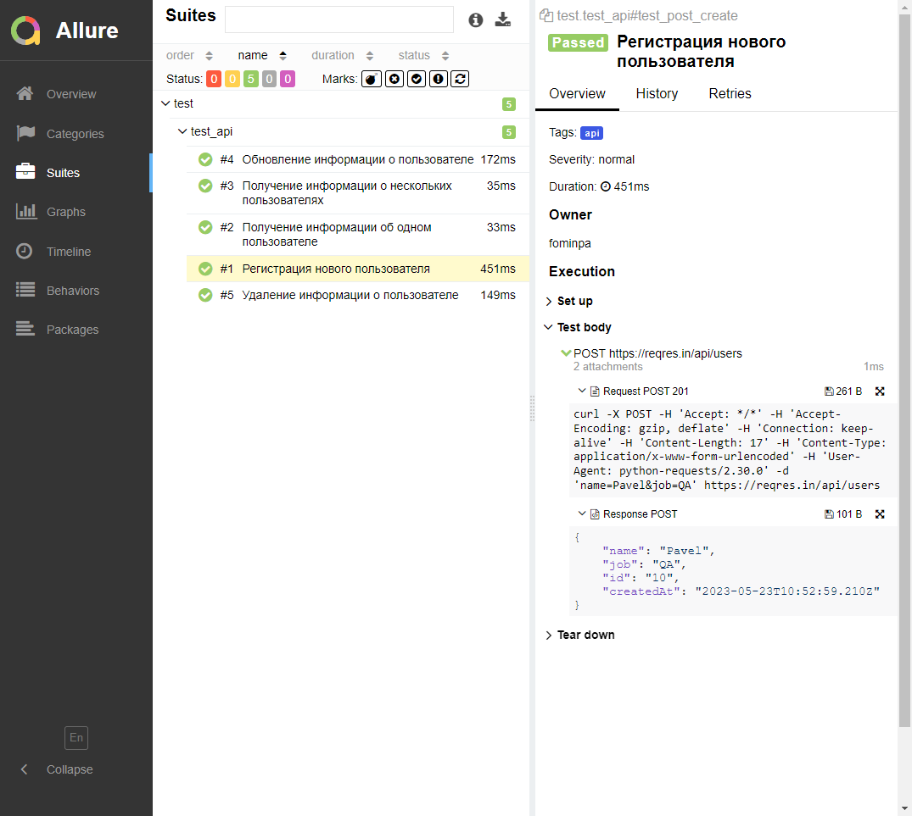

# Автотесты для сайтов

* UI - https://www.last.fm/
* API - https://reqres.in/api/

## Покрыт следующий функционал
* UI тесты
    * ✅ Проверка регистрации пользователя
    * ✅ Проверка поиска исполнителя
    * ✅ Проверка кнопки лайк
    * ✅ Проверка добавления нового плейлиста
    * ✅ Проверка дизлайка
    * ✅ Проверка загрузки аватара
    * ✅ Проверка смены имени профиля
    * ✅ Проверка смены страны
    * ✅ Проверка смены website
    * ✅ Проверка смены информации о себе


* API тесты
  * ✅ Регистрация нового пользователя
  * ✅ Получение информации об одном пользователе
  * ✅ Получение информации о нескольких пользователях
  * ✅ Обновление информации о пользователе
  * ✅ Удаление информации о пользователе


## Технологический стек
<p  align="center">
  <code></code>
  <code></code>
  <code></code>
  <code></code>
  <code></code>
  <code></code>
  <code></code>
  <code></code>
  <code></code>
<!--   <code></code> -->
  <code></code>
</p>

##  Запуск тестов из [Jenkins](https://jenkins.autotests.cloud/job/lastfm_graduate_work_qa_quru/)

Для запуска тестов из Jenkins:
1. Нажмите кнопку "Собрать с параметрами"

<p></p>

2. Выберите параметр ui или api

<p></p>

## Запуск тестов
### Локально
```
pytest .
```

### Удаленно
```bash
rm -rf allure-results/*
python -m venv .venv
source .venv/bin/activate
pip install -r requirements.txt
pytest . --alluredir=allure-results
```

## Отчеты о прохождении тестов доступны в Allure

> При локальном запуске введите в командной строке: 
```bash
allure serve .\allure-results
```

###  Allure

#### Примеры отображения тестов





